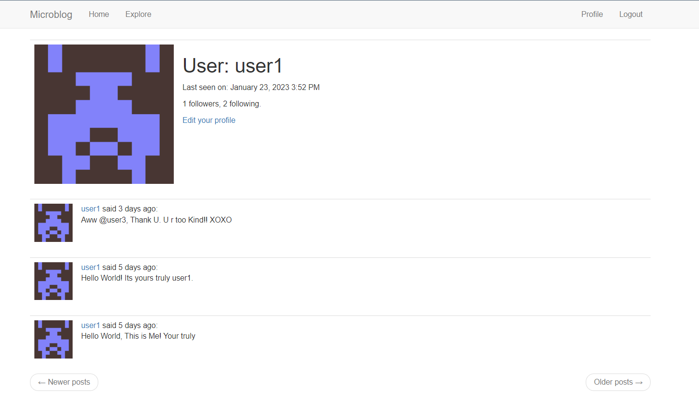
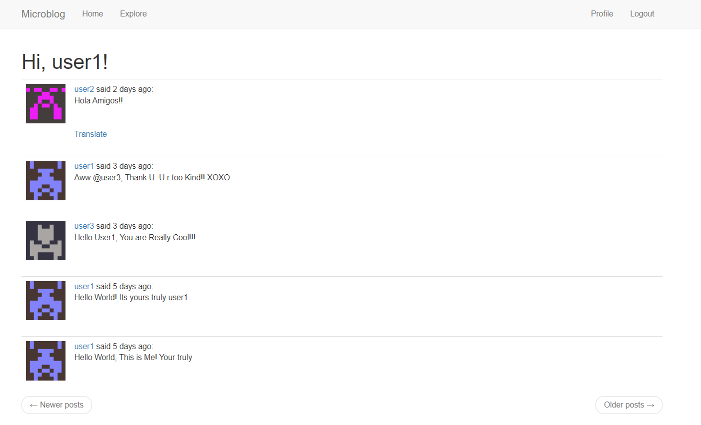
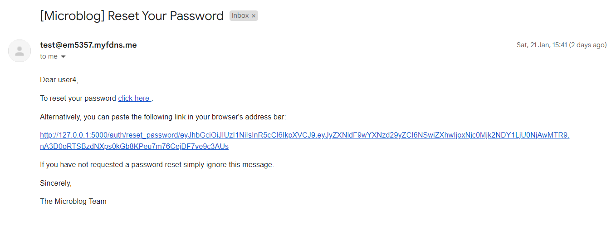

# MICROBLOG

Microblog is a simple microblogging web application with minimalistic user interface. The sole purpose of this project
is to learn and get familiar with flask.

<table>
<tr>
<td>

</td>
<td>

</td>
</tr>
<tr>
<td>

</td>
<td>

</td>
</tr>
</table>

## Getting Started

These instructions will give you a copy of the project up and running on
your local machine for development and testing purposes.

### Prerequisites

Requirements for the software and other tools to build, test and push

- [Git](https://git-scm.com/download/win)
- [Docker](https://www.docker.com/products/docker-desktop/)

### Installing

First of all clone this repo locally using git.

    git clone https://github.com/Im-gkira/Microblog.git

Ensure Docker is installed and running in your local system.-

    docker version

Go to the root folder of the application and build docker container image using-

    docker build -t microblog:latest .

Now we can start a docker container using docker run-

    docker run --name microblog -d -p 8000:5000 --rm microblog:latest

## Running the tests

To run the unit tests designed to check the database queries. Run-

    python tests.py

## Acknowledgments

-
Followed ***[The Flask Mega-Tutorial](https://blog.miguelgrinberg.com/post/the-flask-mega-tutorial-part-i-hello-world)***
by ***Miguel Grinberg***

